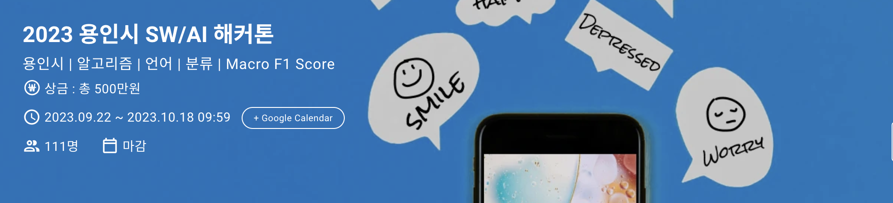
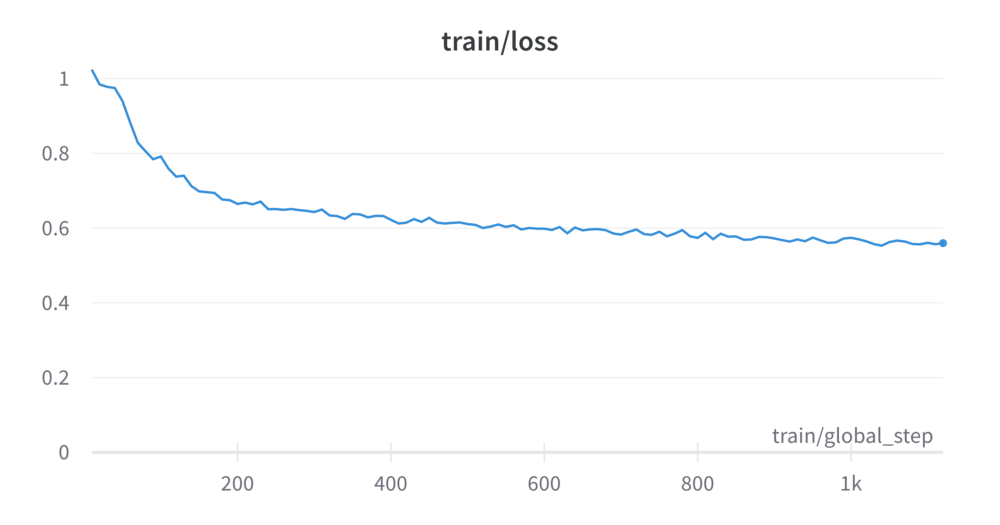
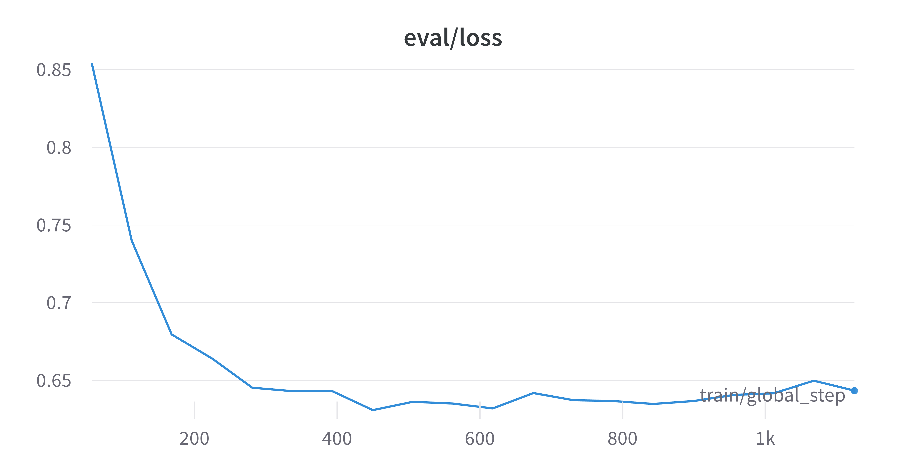
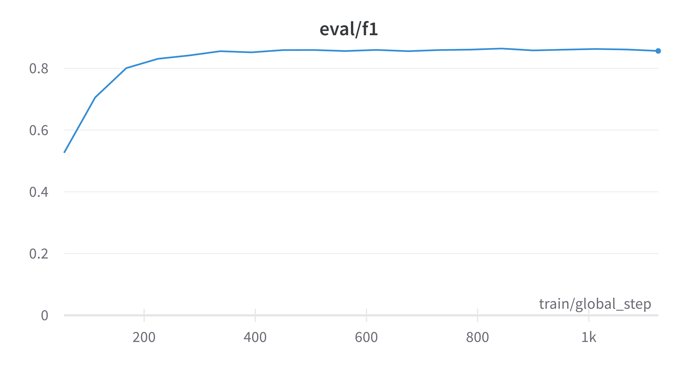

# 2023 용인시 SW/AI 해커톤

**용인시 주최, 한국외국어대학교와 용인시산업진흥원이 주관하는 "2023 용인시 SW/AI 해커톤" 예선**

## 대회 설명
### 주제
트위터 텍스트에 포함된 감성(neutral, positive, negative)을 적절히 분류하는 AI모델을 개발

### 평가
Macro F1 Score

---

## 결과 및 회고
- **Private 3등 (F1 : 0.8476)**
- 전략
  - 사용 모델 : roberta-large (https://huggingface.co/roberta-large)
  - PEFT 방법 중 하나인 LoRA(https://github.com/microsoft/LoRA) 사용해서 Finetuning
    - self-attention의 query와 value 뿐만 아니라 key와 classifier에도 LoRA 삽입.
  - 주요 Hyperparameter
    - rank : 8
    - alpha : 32
    - gradient accumulation step : 32
    - learning rate : 4e-4
    - epochs : 60 (early stopping : 5, 20번째 epoch에서 중단) 
    - seed : 42
- Train/Eval Metric
    - Best Eval f1 : 0.8641
    
    
    